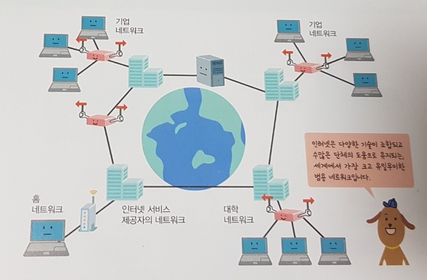

# 컴퓨터 네트워크
*written by sohyeon, hyemin 💡*

 

## 1. 컴퓨터 네트워크란?
`컴퓨터 네트워크`는 여러 대의 컴퓨터를 서로 연결하여 서로 데이터를 주고받을 수 있도록 망이 사전에 구축된 것을 말한다.  
  
* **LAN(Local Area Network)**  
가정이나 사무실처럼 실내에서 비교적 근거리에 위치한 컴퓨터들이 연결한 것을 말한다.
  
* **WAN(Wide Area Network)**  
집 밖이나 회사 건물 밖처럼 비교적 먼 거리에 위치한 컴퓨터들과 연결한 것을 말한다.

### 전 세계의 컴퓨터를 연결하는 인터넷

`인터넷`은 가장 규모가 큰 네트워크로, 인터넷을 통해 서로 다른 네트워크에 속해 있더라도 데이터를 주고받을 수 있다.  

### 모바일 네트워크
`모바일 네트워크`는 휴대전화나 스마트폰을 연결하기 위해 무선 기술을 활용한 네트워크를 말한다.  

### 컴퓨터 네트워크의 역할
이메일, 채팅, VoIP(인터넷 전화), 파일 공유, 주변 기기의 공유, 분산 처리, 파일 전송, 원격 제어, WWW(웹), 동영상 및 음악 스트리밍 서비스 등이 있다.

 

## 2. 서버와 클라이언트
`서버(Server)`는 네트워크에 연결된 컴퓨터들 중 서비스를 제공하는 쪽을 말한다.  
`클라이언트(Client)`는 그 서비스를 받는 쪽을 말한다.

### 서비스별 서버와 클라이언트의 역할
  
| 서비스 이름 | 서버의 역할 | 클라이언트의 역할 |
|:---:|:---:|:---:|
| 웹 서비스 | 클라이언트로부터 요청을 받고 해당하는 웹 페이지를 전송한다. | 서버에 웹 페이지를 요청하고 응답으로 받은 웹 페이지를 화면에 표시한다. |
| 메일 서비스 | 메일을 전달하는 송신 기능과 받은 메일을 저장하는 수신 기능이 있다. | 사용자가 작성한 메일을 메일 서버로 보내고 다른 사람이 보낸 메일을 받아 화면에 표시한다. 
| FTP 서비스 | 서버 컴퓨터의 하드 디스크 폴더 안으로 업로드한 파일을 저장하는 기능과 하드 디스크 폴더 안에 있는 파일을 다운로드하는 기능이 있다. | 클라이언트 PC에 저장된 파일을 서버에 업로드하거나 서버의 파일을 클라이언트 PC에 다운로드한다. |
| 원격 제어 서비스 | 클라이언트가 내린 명령을 서버에서 실행하고 그 결과를 클라이언트에게 보여준다. | 사용자의 제어 명령을 원격지의 서버에 전달하고 그 결과를 받아 화면에 표시한다. |

### 피어 투 피어 
네트워크에 연결된 두 대의 컴퓨터가 클라이언트와 서버의 역할을 동시에 할 수 있어서 서로에게 서비스를 주거나 받을 수 있는 통신 방식이다.

 

## 3. 패킷 교환 방식
### 패킷 교환 방식이란?
이메일이나 파일과 같은 데이터를 `패킷(Packet)`이라는 작은 단위로 분할한 후 주고받는다.  

### 회선 교환 방식과 패킷 교환 방식
* **회선 교환 방식**
    * 통신하려는 양측을 연결하기 위해 하나의 통신 경로를 점유한 후 통신하는 방식이다.  
    * 일대일 통신이며, 통신 속도가 안정적이라는 장점이 있다. 
    
* **패킷 교환 방식**
    * 주고받을 데이터를 작게 쪼갠 후 다른 데이터의 조각들과 통신 경로를 공유하며 전송하는 방식이다.
    * 여러 상대와 통신할 때 효과적이지만, 주고받는 패킷이 많아지면 전송 속도가 느려질 수 있다. 

 

## 4. 컴퓨터 네트워크와 계층 모델

* **애플리케이션 계층**
    * 웹 서비스, 이메일과 같은 서비스를 사용자에게 제공한다.

* **트랜스포트 계층**
    * 애플리케이션 계층과 인터넷 계층 사이에서 데이터가 올바르게  전달되도록 중계한다.  

* **인터넷계층**
    * 목적지의 IP Address로 데이터를 전달한다.
    
* **네트워크 인터페이스 계층**
    * 네트워크 어댑터와 같은 하드워어를 통해 데이터를 전달한다.  

 

## 5. 4개 계층의 동작 방식

 

## 6. 통신 규약과 프로토콜

 

## 7. 인터넷의 영향
