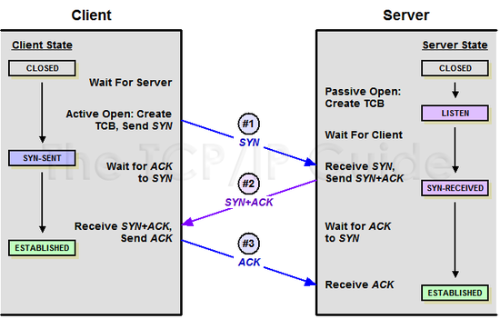
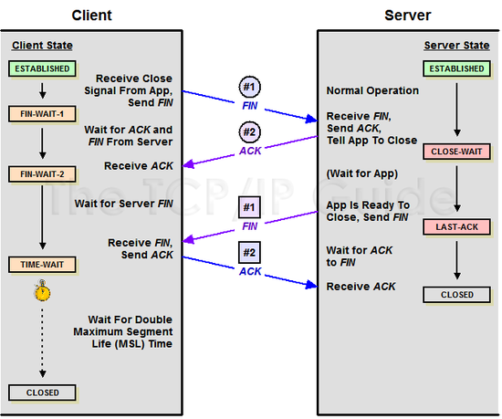

 # 트랜스포트 계층
*written by sohyeon, hyemin 💡*

<br>

## 글 목차
### [1. 트랜스포트 계층이란?](#1-트랜스포트-계층이란-1)
### [2. 포트 번호](#2-포트-번호-1)
### [3. TCP 프로토콜](#3-TCP-프로토콜-1)
### [4. UDP 프로토콜](#4-UDP-프로토콜-1)

<br>

## 1. 트랜스포트 계층이란?
`트랜스포트 계층`은 애플리케이션 계층과 인터넷 계층 사이에 위치한다.  
트랜스포트 계층의 역할은 컴퓨터가 받은 데이터를 애플리케이션까지 전달하는 것이다.  

트랜스포트 계층에서 사용하는 대표적인 프로토콜은 `전송의 신뢰성을 중시하는 TCP`와 `전송 속도를 중시하는 UDP`가 있다.

<br>

## 2. 포트 번호
트랜스포트 계층에는 인터넷 계층에서 전달한 다양한 종류의 패킷이 들어온다.  
이 패킷들은 애플리케이션 계층에 있는 애플리케이션들에게 각각 전달되어야 하는데, 이때 `포트번호`를 보면 어느 애플리케이션으로 보내져야 할지를 알 수  있다.

### 포트 번호의 범위
포트 번호는 0~65535번까지 사용할 수 있고, `웰 노운 포트(well-known ports), 레지스터드 포트(registered ports), 다이나믹 포트(dynamic ports)`의 세 종류로 구분된다.  


`웰 노운 포트`는 서버 프로그램이 수신 대기할 때 사용하는 포트이다.  
`레지스터드 포트`는 벤더가 할당받아 사용하는 포트이다.
`다이나믹 포트`는 클라이언트 프로그램이 사용하는 포트이다. 또한, 클라이언트가 사용하는 포트 번호는 다이나믹 포트 번호 대역에서 자동으로 할당되기 때문에 어떤 번호가 사용될지는 미리 알 수 없다.  
  
포트는 IANA라는 단체가 관리한다.
 
### 주요 Well-Known Port
서버 측에서 사용하는 포트는 미리 정해져 있다.  
| 포트 번호 | 대응하는 프로토콜 |
|:---:|:---:|
| 20번 | FTP(액티브 모드에서는 데이터 커넥션, 패시브 모드에서는 랜덤 포트를 사용함) |
| 21번 | FTP(컨트롤 커넥션) |
| 22번 | SSH(원격 제어, 보안 기능 있음) |
| 23번 | Telnet(원격 제어) |
| 25번 | SMTP(이메일 전송) |
| 80번 | HTTP(웹) |
| 110번 | POP3(이메일 수신) |
| 143번 | IMAP4(이메일 수신, 보관 기능 있음) |

### 클라이언트와 서버의 접속이 완료되기까지의 과정
클라이언트와 서버가 서로 통신하기 위해서는 먼저 `클라이언트가 사용할 포트를 결정`하고 이후 `서버의 포트에 접속`하게 된다.  
HTTP인 경우 서버 측에서 수신 대기하는 포트 번호는 80번이고 클라이언트인 웹 브라우저는 다이나믹 포트를 사용하기 때문에 포트 번호가 정해져 있지 않다.  
<br>

## 3. TCP 프로토콜
### TCP란?
`TCP(Transmission Control Protocol)`는 트랜스포트 계층의 프로토콜의 하나로 웹이나 이메일, FTP와 같이 정확한 데이터 전달이 필요한 통신에 사용된다.  
`TCP`는 데이터 전송에 신뢰성을 더하기 위해 `데이터를 세그먼트(segment)라는 단위로 분할`하고, `전송 속도를 조정`하며, `데이터가 제대로 전달되지 않았을 경우 재전송`을 하게 된다.  

### TCP 헤더의 구조
TCP의 세그먼트는 데이터 본체에 TCP 헤더가 붙은 형태로 구성된다.  


* `일련번호(sequence number)` : 송신한 바이트 수
* `확인 응답 번호(acknowledgement number)` : 수신한 바이트 수
* `데이터 옵셋(data offset)` : TCP 헤더의 길이
* `윈도우 사이즈(windows size)` : 한 번에 수신할 수 있는 데이터 크기
* `체크섬(checksum)` : 데이터가 훼손되었는지 확인하기 위한 정보

### 컨트롤 비트
TCP 헤더 중 `컨트롤 비트`는 현재의 통신 상태를 표현하는 플래그 역할을 하며, 통신 상대에게 이 정보를 전달해서 TCP 통신을 제어하는 용도로 사용한다.  
9개의 플래그 각각은 1비트 크기를 차지하여 ON/OFF 두 가지 상태를 표현한다.

| 플래그 | 역할 |
|:---:|:---:|
| CWR | 통신 경로가 혼잡해서 전송량을 줄여줄 것을 알려준다. |
| ECE | 통신 경로가 혼잡해서 수신할 수 없을 수도 있다는 것을 알려준다. |
| URG | 긴급 포인터에서 지정한 데이터를 즉시 처리해야 한다는 것을 알려준다. |
| ACK | 이전 동작을 확인했다는 것을 알려준다. 확인 응답 번호와 조합해서 사용된다. |
| PSH | 수신 데이터를 즉시 애플리케이션 계층에 전달해야 한다는 것을 알려준다. |
| RST | 이상 상황이 발생하여 접속이 강제 중단되었다는 것을 알려준다. |
| SYN | 접속을 시작할 때 ON으로 설정한다. |
| FIN | 데이터 송신이 완료되어 통신을 종료하고 싶다는 것을 알려준다. |
<br>

### 통신 개시부터 통신 종료까지의 흐름
  
* #### 3-way handshake (연결 성립)
TCP 통신은 통신하기에 앞서, 접속이 성립하기 위해 3-way handshake를 진행한다.  



```
1. 클라이언트가 서버에게 SYN 패킷을 보낸다. 이때 클라이언트는 SYN을 보내고 SYN/ACK 응답을 기다리는 SYN_SENT 상태가 된다.
2. 서버는 SYN 요청을 받고 클라이언트에게 요청을 수락한다는 ACK와 SYN flag가 설정된 패킷을 보낸다. 이때 서버는 SYN_RECEIVED 상태가 된다. 
3. 클라이언트는 서버의 응답인 ACK와 SYN 패킷을 받고, ACK를 서버로 보낸다. 
```
이렇게 3번의 통신이 완료되면 연결이 성립된다.  
  
* #### 4-way handshake (연결 해제)
TCP 통신은 연결 성립 후, 모든 통신이 끝났다면 해제해야 한다.  
  


```
1. 클라이언트는 서버에게 연결을 종료한다는 FIN 플래그를 보낸다. 
2. 서버는 FIN을 받고, 확인했다는 ACK를 클라이언트에게 보낸다. 이때 서버는 CLOSE_WAIT 상태다.
3. 서버는 데이터를 모두 보냈다면, 연결이 종료되었다는 FIN 플래그를 클라이언트에게 보낸다.
4. 클라이언트는 FIN을 받고, 확인했다는 ACK를 서버에게 보낸다.(클라이언트는 서버로부터 받지 못한 데이터가 있을 수 있으므로 TIME_WAIT을 통해 기다린다.)
    => TIME_WAIT : 클라이언트는 서버로부터 FIN을 수신하더라도 일정시간 동안 세션을 남겨놓고 받지 못한 패킷을 기다리는 것을 말한다.
    => 서버는 ACK를 받은 이후 소켓을 닫는다. 클라이언트 또한, TIME_WAIT 시간이 끝나면 소켓을 닫는다.
```
이렇게 4번의 통신이 완료되면 연결이 해제된다.  
  
### 흐름 제어(flow control)
`흐름 제어`는 `송신 측(호스트)과 수신 측(호스트)의 데이터 처리 속도 차이`를 해결하기 위한 기법이다. 
  
수신 측은 도착한 패킷들을 버퍼에 쌓아 두는 것과 동시에 이미 버퍼에 쌓인 데이터를 순차적으로 꺼내서 처리하게 된다.  
이때 만약 수신 측 컴퓨터의 성능이 낮다면 `데이터가 들어오는 속도보다 처리하는 속도가 느려져` 문제가 될 수 있다.  
그래서 수신 측은 응답을 보낼 때 `윈도우 사이즈를 설정`하여 `현재 어느 정도까지 수신할 수 있는지`를 수시로 알려주게 된다.  


### 혼잡 제어
`혼잡 제어`는 `송신 측(호스트)의 데이터 전달`과 `네트워크(라우터)의 데이터 처리 속도 차이`를 해결하기 위한 기법이다.  

송신 측의 데이터는 지역망이나 인터넷으로 연결된 대형 네트워크를 통해 전달된다.  
만약 하나의 라우터에게 데이터가 몰릴 경우, 라우터는 자신에게 온 데이터를 모두 처리할 수 없다.  
그렇게 되면 호스트들은 또 다시 재전송을 하게 되고 결국 혼잡을 가중시켜 오버플로우나 데이터 손실을 발생시킨다.
따라서, 이러한 네트워크의 혼잡을 피하기 위해 송신 측에서 보내는 데이터의 전송 속도를 강제로 줄이게 되는데, 이러한 작업을 `혼잡제어`라고 한다.  

<br>

## 4. UDP 프로토콜

### UDP란?
`UDP(User Datagram Protocol)`는 TCP에 비해 상당히 간단한 프로토콜로서 단순히 데이터를 보내는 역할만 한다.  
통신 과정에서 데이터의 손실이 발생할 수 있는데, VoIP와 같은 음성 서비스나 동영상 스트리밍 서비스는 일부 데이터가 누락되거나 왜곡되더라도 큰 문제가 없기 때문에 UDP를 주로 사용한다.  

### UDP 헤더 구조
UDP에서는 패킷에 해당하는 것을 `데이터그램`이라고 부른다.  
  
 
  
* `패킷 길이(UDP length)` : 헤더 길이와 데이터 길이의 합계
* `체크섬(checksum)` : 데이터가 훼손되었는지 확인하기 위한 정보

### 브로드캐스트 & 멀티캐스트
TCP에는 없는 기능으로 UDP에는 하나의 패킷을 여러 수신지에 전달하는 `브로드캐스트(broadcast)`와 `멀티캐스트(multicast)`라는 기능이 있다.  
* `브로드캐스트(broadcast)` 
    - local LAN 상에 붙어있는 모든 네트워크 장비들에게 보내는 통신이다.  
    - 통신의 대상이 특정한 한 네트워크가 아니라, 네트워크 안의 모든 장비들에게 통신을 하는 방식이라고 생각하면 된다.
  
* `멀티캐스트(multicast)`
    - 보내고자 하는 정보를 그룹 내의 일정 네트워크 장비들에게만 한번에 보낼 수 있는 통신이다.  
    
<br>

## Reference & Additional Resources
* TCP/IP 쉽게, 더 쉽게
* * [[네트워크 쉽게 이해하기 22편] TCP 3 Way-Handshake & 4 Way-Handshake](https://mindnet.tistory.com/entry/%EB%84%A4%ED%8A%B8%EC%9B%8C%ED%81%AC-%EC%89%BD%EA%B2%8C-%EC%9D%B4%ED%95%B4%ED%95%98%EA%B8%B0-22%ED%8E%B8-TCP-3-WayHandshake-4-WayHandshake)
