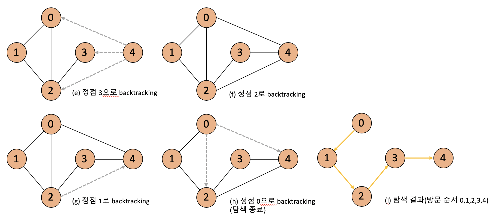

# 깊이 우선 탐색(Depth First Search : BFS)
*written by sohyeon, hyemin 💡*

<br>

## 1. 깊이 우선 탐색(DFS)이란?
  
`깊이 우선 탐색(Depth First Search)`은 루트 노드(혹은 다른 임의의 노드)에서 시작해서 다음 분기(branch)로 넘어가기 전에 해당 분기를 완벽하게 탐색하는 방법이다.  
  
* 미로를 탐색할 때 한 방향으로 갈 수 있을 때까지 계속 가다가 더 이상 갈 수 없게 되면 다시 가까운 갈림길로 돌아와서 이곳으로부터 다른 방향으로 다시 탐색을 진행하는 방법과 유사하다.  
  
* 그래프에서 모든 노드를 방문하고자 할 때 더 선호되는 편이다.  

## 2. 깊이 우선 탐색(DFS)의 특징
  
* 전위 순회를 포함한 다른 형태의 트리 순회는 모두 깊이 우선 탐색(DFS)의 한  종류이다.  
  
* 그래프 탐색의 경우 `어떤 노드를 방문했었는지 여부를 반드시 검사`해야 한다는 것이다.  
    * 검사하지 않을 경우 무한루프에 빠질 위험이 있다.  
  
* 깊이 우선 탐색은 자기 자신을 다시 호출하는 `순환 알고리즘`의 형태를 가지고 있다. 

<br>

## 3. 깊이 우선 탐색(DFS)의 과정
```
1. 그래프의 시작 노드에서 출발하여 먼저 시작 노드 v를 방문하고 방문하였다고 표시한다.
2. v에 인접한 노드들 중에서 아직 방문하지 않은 노드 u를 선택한다.
3. 만약 그러한 노드가 없다면 탐색은 종료한다.
4. 만약 아직 방문하지 않은 노드 u가 있다면 u를 시작 노드로 하여 깊이 우선 탐색을 다시 시작한다.
5. 이 탐색이 끝나게 되면 다시 v에 인접한 노드들 중에서 아직 방문이 안 된 노드를 찾는다.
6. 없을 경우 종료하고, 있다면 다시 그 노드를 시작 노드로 하여 깊이 우선 탐색을 다시 시작한다. 
```




* 0번 노드를 시작 노드로 선택하고 이미 방문한 노드는 주황색으로 표시하였다.  
  
* 점선 화살표는 이미 방문한 노드로의 방문을 시도하다가 실패한 간선을 의미하고, 실선 화살표는 실제로 방문하는 간선을 의미한다.  

<br>

## 4. 깊이 우선 탐색(DFS)의 구현
구현 방법에는 `순환 호출을 이용하는 것`과 `명시적인 스택을 사용하는 것(방문한 노드들을 스택에 저장하였다가 다시 꺼내어 작업하는 것)`이다.  
  
#### ex) 순환 호출을 이용한 DFS를 구현한 의사코드(pseudocode)
```
void search(Node root) {
    if (root == null) return;    
    // root 노드를 방문한다.
    visit(root);
    root.visited = true; 
    // root 노드와 인접한 정점을 모두 방문한다.
    for each (Node n in root.adjacent) {
        // 방문하지 않은 노드가 있다면 root 노드와 인접한 정점 정점을 시작 정점으로 DFS를 시작
        if (n.visited == false) {
            search(n); 
        }
    }
}
https://gmlwjd9405.github.io/2018/08/14/algorithm-dfs.html
```
  
#### ex) 순환 호출을 이용한 DFS 구현
```
import java.io.*; 
import java.util.*; 

// 인접 리스트를 이용한 방향성 있는 그래프 클래스 
class Graph { 
    private int V; // 노드의 개수
    private LinkedList<Integer> adj[]; // 인접 리스트

    // Constructor(생성자)
    Graph(int v) { 
        V = v; 
        adj = new LinkedList[v]; 
        for (int i=0; i<v; ++i) 
            adj[i] = new LinkedList(); 
    } 

    // 노드를 연결한다. (v->w)
    void addEdge(int v, int w) { 
        adj[v].add(w); // Add w to v's list. 
    } 

    // DFS에 의해 사용되는 함수
    void DFSUtil(int v,boolean visited[]) { 
        // 현재 노드를 방문한 것으로 표시하고 값 출력한다.
        visited[v] = true; 
        System.out.print(v+" "); 

        // 방문한 노드와 인접한 모든 노드를 가져온다.
        Iterator<Integer> i = adj[v].listIterator(); 
        while (i.hasNext()) { 
            int n = i.next(); 
            
            // 방문하지 않은 노드면 해당 노드를 시작 노드로 하고 DFSUtil을 호출한다.
            if (!visited[n]) 
                DFSUtil(n, visited); 
            } 
    } 

    // 주어진 노드를 시작 노드로 DFS를 탐색한다.
    void DFS(int v) { 
        // 노드의 방문 여부를 판단한다.
        boolean visited[] = new boolean[V]; 

        // v를 시작 노드로 하여 DFSUtil을 순환 호출한다.
        DFSUtil(v, visited); 
    } 


    // 2를 시작 노드로 하여 DFS를 탐색한다.
    public static void main(String args[]) { 
        Graph g = new Graph(4); 

        g.addEdge(0, 1); 
        g.addEdge(0, 2); 
        g.addEdge(1, 2); 
        g.addEdge(2, 0); 
        g.addEdge(2, 3); 
        g.addEdge(3, 3); 
        
        g.DFS(2); 
    } 
} 

```
<br> 

## Reference & Additional Resources
* 코딩인터뷰 완전 분석  

* C언어로 쉽게 풀어쓴 자료 구조  

* [https://www.geeksforgeeks.org/depth-first-search-or-dfs-for-a-graph/](https://www.geeksforgeeks.org/depth-first-search-or-dfs-for-a-graph/)

