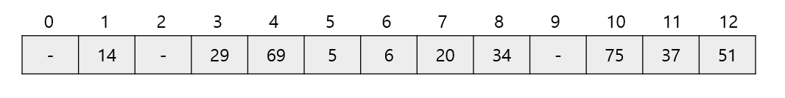
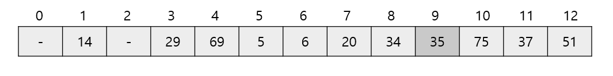

# 해시 알고리즘 (Hash)
*written by sohyeon, hyemin 💡*

<br>

## 1. 해시법

### 1) 해시 테이블

`해시`에 대해 이해하기 위해서 해시법에 사용되는 자료구조인 `해시 테이블`에 대해 이해해야 한다.  

`해시 테이블`은 연관배열 구조를 이용하여 키(key)에 결과 값(value)을 저장하는 자료구조이다.

- 연관배열 구조(associative array)
  
  키(key) 1개와 값(value) 1개가 1:1로 연관되어 있는 자료구조이다.  
  따라서 키(key)를 이용하여 값(value)을 도출할 수 있다.  

### 2) 해시 테이블 구조


키(Key), 해시함수(Hash Function), 해시(Hash), 값(value), 버킷(Bucket, Slot)로 이루어져 있다.  

키(key)는 해시함수(hash function)를 통해 해시(hash)로 변경이 되며  
해시는 값(value)과 매칭되어 버킷에 저장이 된다.  

- 키(key)

  고유한 값이며, 해시 함수의 input이 된다. 다양한 길이의 값이 입력될 수 있다.  
  이 상태로 최종 버킷에 저장이 되면 다양한 길이 만큼의 버킷를 구성해 두어야 하기 때문에  
  해시 함수로 값을 바꾸어 저장이 되어야 공간의 효율성을 추구할 수 있다.

- 해시함수(Hash Function)

  키를 해시로 바꿔주는 역할을 한다.  
  다양한 길이를 가지고 있는 키를 일정한 길이를 가지는 해시로 변경하여  
  버킷를 효율적으로 운영할 수 있도록 도와준다.  
  
- 해시(Hash)
  
  해시 함수의 결과물이며, 버킷에서 값과 매칭되어 저장된다.

- 값(Value)
  
  버킷에 최종적으로 저장되는 값으로 키와 매칭되어 저장, 삭제, 검색, 접근이 가능해야 한다.

### 2) 해시 예시

배열의 키 값을 13으로 나눈 나머지를 아래 표와 같이 나타낼 수 있다.  
이렇게 표에 정리한 값을 `해시 값`이라고 한다.  

|키 값(원래 값)|5|6|14|20|29|34|37|51|69|75|
|:---|:---:|:---:|:---:|:---:|:---:|:---:|:---:|:---:|:---:|:---:|
|해시 값(13으로 나눈 나머지)|5|6|1|7|3|8|11|12|4|10|

해시 값이 인덱스가 되도록 원래의 키 값을 저장한 배열이 `해시 테이블`이다.



새로운 값이 추가되는 경우에는 동일하게 해시값을 구하고 해시테이블에 추가하면 된다.  
35를 추가한다고 가정하면, 35%19=9 이므로 배열[9]에 값 35를 저장한다.  



값을 추가할 때 배열 요소를 모두 옮기지 않아도 된다는 특징을 볼 수 있다.  

## 2. 해시 충돌(Hash Collision)

서로 다른 키가 같은 해시가 되는 경우를 `해시 충돌(Hash Collision)`이라고 하는데,  
해시 충돌을 일으키는 확률을 최대한 줄이는 함수를 만드는 것이 중요하다.  

해시 함수는 가능하면 해시 값이 치우치지 않도록 고르게 분포된 값을 만들어야 한다.  
충돌이 발생할 경우 두 가지 방법으로 대처할 수 있다.  

### 1) 체인법

같은 해시 값을 갖는 데이터를 쇠사슬 모양으로 연결 리스트를 이용해 연결하는 방법이다.  
오픈 해시법이라고도 한다.

  

배열의 각 버킷(해시 테이블)에 저장하는 값은  
그 인덱스를 해시 값으로 하는 연결 리스트의 첫번째 노드에 대한 참조이다.
데이터가 하나도 없는 버킷의 값은 null을 가리킨다.

### - 장단점

- 장점
	- 한정된 저장소(Bucket)을 효율적으로 사용할 수 있다.
	- 해시 함수(Hash Function)을 선택하는 중요성이 상대적으로 적다.
	- 상대적으로 적은 메모리를 사용한다. 미리 공간을 잡아 놓을 필요가 없다.

- 단점
	- 한 Hash에 자료들이 계속 연결된다면(쏠림 현상) 검색 효율을 낮출 수 있다.
	- 외부 저장 공간을 사용한다.
	- 외부 저장 공간 작업을 추가로 해야 한다.

### 2) 체인법을 활용한 해시 구현

* 체인법으로 구현한 클래스

```Java
// 해시를 구성하는 노드, 개별 버킷을 나타냄
class Node<K,V>{
    K key   // 키 값
    V data  // 데이터
    Node<K,V> next; // 다음 노드에 대한 참조

    // 생성자
    Node(K key, V data, Node<K,V> next) {
        this.key  = key;
        this.data = data;
        this.next = next;
    }

    // 키 값을 반환합니다.
    K getKey() {
        return key;
    }

    // 데이터를 반환합니다.
    V getValue() {
        return data;
    }

    // 키의 해시값을 반환합니다.
    public int hashCode() {
        return key.hashCode();
    }
}
```

* 메서드

```Java
public class ChainHash<K,V> {
    private int	size;						// 해시 테이블의 크기
	private Node<K,V>[] table;				// 해시 테이블

	// 생성자
	public ChainHash(int capacity) {
		try {
			table = new Node[capacity];
			this.size = capacity;
		} catch (OutOfMemoryError e) {		// 테이블을 생성할 수 없음
			this.size = 0;
		}
	}

	// 해시값을 구함
	public int hashValue(Object key) {
		return key.hashCode() % size;
	}

	// 키 값 key를 갖는 요소의 검색 (데이터를 반환)
	public V search(K key) {
		int hash = hashValue(key);			// 검색할 데이터의 해시값
		Node<K,V> p = table[hash];			// 선택 노드

		while (p != null) {
			if (p.getKey().equals(key))
				return p.getValue();		// 검색 성공
			p = p.next;						// 다음 노드에 주목
		}
		return null;						// 검색 실패
	}

	// 키 값 key, 데이터 data를 갖는 요소의  추가
	public int add(K key, V data) {
		int hash = hashValue(key);			// 추가할 데이터의 해시값
		Node<K,V> p = table[hash];			// 선택 노드

		while (p != null) {
			if (p.getKey().equals(key))		// 이 키 값은 이미 등록됨
				return 1;
			p = p.next;						// 다음 노드에 주목
		}
		Node<K,V> temp = new Node<K,V>(key, data, table[hash]);
		table[hash] = temp;					// 노드를 삽입
		return 0;
	}

	// 키 값 key를 갖는 요소의 삭제
	public int remove(K key) {
		int hash = hashValue(key);			// 삭제할 데이터의 해시 값
		Node<K,V> p = table[hash];			// 선택 노드
		Node<K,V> pp = null;				// 바로 앞의 선택 노드

		while (p != null) {
			if (p.getKey().equals(key)) {	//  찾으면
				if (pp == null)
					table[hash] = p.next;
				else
					pp.next = p.next;
				return 0;
			}
			pp = p;
			p = p.next;						// 다음 노드를 가리킴
		}
		return 1;							// 그 키 값은 없습니다. 
	}

	// 해시 테이블을 덤프
	public void dump() {
		for (int i = 0; i < size; i++) {
			Node<K,V> p = table[i];
			System.out.printf("%02d  ", i);
			while (p != null) {
				System.out.printf("→ %s (%s)  ", p.getKey(), p.getValue());
				p = p.next;
			}
			System.out.println();
		}
	}
}
```

### 3) 오픈 주소법

`오픈 주소법`은 충돌이 발생했을 때 다시 해시를 수행하여 비어 있는 버킷을 찾아내는 방법으로,  
닫힌 해시법이라고도 합니다.  

### - 요소 삽입


이렇게 오픈 주소법은 빈 버킷을 만날 때 까지 `재해시`를 여러 번 반복하므로 선형 탐사법이라고도 합니다.  

### - 요소 삭제

위와 같이 요소 삽입이 완료된 상태에서 인덱스가 5인 값을 삭제하는 상황으로 가정했을 때,  
단순하게 인덱스가 5인 버킷의 데이터를 비우는 것이 아니다.  

왜냐하면 같은 해시 값을 갖는 18을 검색할 때  
'해시 값이 5인 데이터는 존재하지 않는다'라고 생각해 검색에 실패하기 때문이다.  

그래서 각 버킷에 속성 값을 부여한다.  

- 데이터 저장 속성값
- 비어 있음 속성값
- 삭제 마침 속성 값

### - 요소 검색

버킷의 속성 값을 활용하면 요소 검색의 두가지 경우를 알맞게 수행할 수 있다.
특정 값을 검색했을 때,  

1. 버킷 속성 값이 비어 있음 
   -> 검색 실패

2. 버킷 속성 값이 삭제 마침  
   -> 동일한 해시 값을 가진 원하는 값을 찾을 때 까지 재해시 반복
   -> 검색 성공

### - 장단점

- 장점
	- 또 다른 저장공간 없이 해시테이블 내에서 데이터 저장 및 처리가 가능하다.
	- 또 다른 저장공간에서의 추가적인 작업이 없다.

- 단점
	- 해시 함수(Hash Function)의 성능에 전체 해시테이블의 성능이 좌지우지된다.
	- 데이터의 길이가 늘어나면 그에 해당하는 저장소를 마련해 두어야 한다.


### 4) 오픈 주소법을 활용한 해시 구현

```Java
// 오픈 주소법에 의한 해시

public class OpenHash<K,V> {
	// 버킷의 상태
	enum Status {OCCUPIED, EMPTY, DELETED};		// {데이터 저장, 비어 있음, 삭제 마침}

	// 버킷
	static class Bucket<K,V> {
		private K key;							// 키 값
		private V data;							// 데이터
		private Status stat;					// 상태

		// 생성자
		Bucket() {
			stat = Status.EMPTY;				// 버킷은 비어 있음
		}

		// 모든 필드에 값을 설정합니다.
		void set(K key, V data, Status stat) {
			this.key  = key;					// 키 값
			this.data = data;					// 데이터
			this.stat = stat;					// 상태
		}

		// 상태를 설정합니다.
		void setStat(Status stat) {
			this.stat = stat;
		}

		// 키 값을 반환합니다.
		K getKey() {
			return key;
		}

		// 데이터를 반환합니다.
		V getValue() {
			return data;
		}

		// 키의 해시 값을 반환합니다.
		public int hashCode() {
			return key.hashCode();
		}
	}

	private int size;						// 해시 테이블의 크기
	private Bucket<K,V>[] table;			// 해시 테이블

	// 생성자
	public OpenHash(int size) {
		try {
			table = new Bucket[size];
			for (int i = 0; i < size; i++)
				table[i] = new Bucket<K,V>();
			this.size = size;
		} catch (OutOfMemoryError e) {		// 테이블을 생성할 수 없음
			this.size = 0;
		}
	}

	// 해시 값을 구함
	public int hashValue(Object key) {
		return key.hashCode() % size;
	}

	// 재해시값을 구함
	public int rehashValue(int hash) {
		return (hash + 1) % size;
	}

	// 키 값 key를 갖는 버킷의 검색
	private Bucket<K,V> searchNode(K key) {
		int hash = hashValue(key);				// 검색할 데이터의 해시값
		Bucket<K,V> p = table[hash];			// 선택 버킷

		for (int i = 0; p.stat != Status.EMPTY && i < size; i++) {
			if (p.stat == Status.OCCUPIED && p.getKey().equals(key))
				return p;
			hash = rehashValue(hash);			// 재해시
			p = table[hash];
		}
		return null;
	}

	// 킷값 key를 갖는 요소의 검색 (데이터를 반환)
	public V search(K key) {
		Bucket<K,V> p = searchNode(key);
		if (p != null)
			return p.getValue();
		else
			return null;
	}

	// 키 값 key, 데이터 data를 갖는 요소의  추가
	public int add(K key, V data) {
		if (search(key) != null)
			return 1;							// 이 키 값은 이미 등록됨

		int hash = hashValue(key);				// 추가할 데이터의 해시 값
		Bucket<K,V> p = table[hash];			// 선택 버킷
		for (int i = 0; i < size; i++) {
			if (p.stat == Status.EMPTY || p.stat == Status.DELETED) {
				p.set(key, data, Status.OCCUPIED);
				return 0;
			}
			hash = rehashValue(hash);			// 재해시
			p = table[hash];
		}
		return 2;								// 해시 테이블이 가득 참
	}

	// 키 값 key를 갖는 요소의 삭제
	public int remove(K key) {
		Bucket<K,V> p = searchNode(key);		// 선택 버킷
		if (p == null)
			return 1;							// 이 키 값은 등록되지 않음

		p.setStat(Status.DELETED);
		return 0;
	}

	// 해시 테이블을 덤프
	public void dump() {
		for (int i = 0; i < size; i++) {
			System.out.printf("%02d ", i);
			switch (table[i].stat) {
			 case OCCUPIED : 
				System.out.printf("%s (%s)\n", 
										table[i].getKey(), table[i].getValue());
				break;

			 case EMPTY :
			 	System.out.println("-- 미등록 --");	break;

			 case DELETED :
			 	System.out.println("-- 삭제 마침 --");	break;
			}
		}
	}
}
```

<br> 

## Reference & Additional Resources
  
> Do it! 자료구조와 함께 배우는 알고리즘 입문, 자바 편
