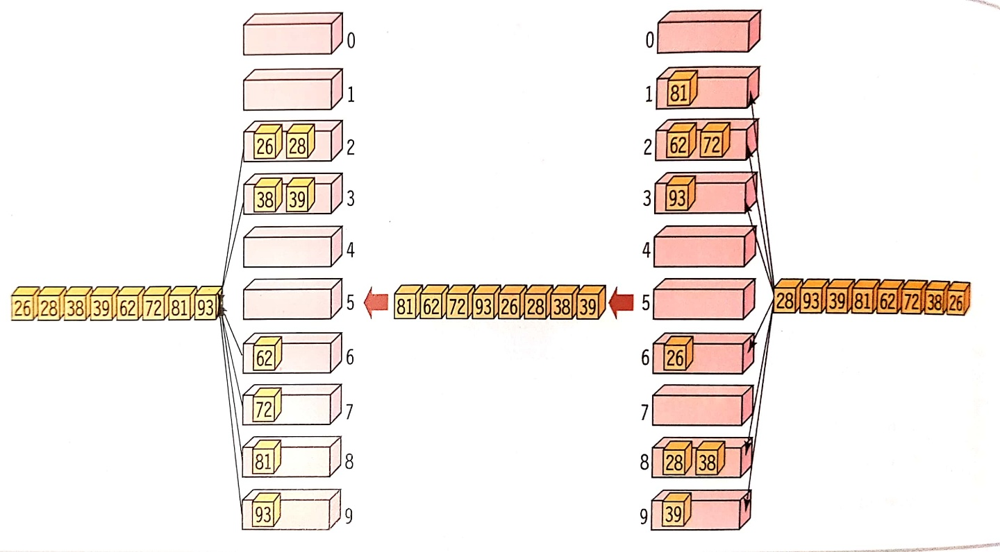

# 기수 정렬 (Radix Sort)
*written by sohyeon, hyemin 💡*

<br>

## 1. 기수 정렬이란?

`기수 정렬`은 낮은 자리수부터 비교하여 정렬해 간다는 것을 기본 개념으로 하는 정렬 알고리즘이다.  
기수 정렬은 입력 데이터에 대해서 어떤 비교 연산도 실행하지 않고 데이터를 정렬할 수 있는 색다른 정렬 기법이다.  

<br>

## 2. 동작 방식



`10개의 버켓(bucket)`을 만들어서 입력 데이터를 일의 자릿수부터 각 자릿수의 값에 따라 버켓에 넣는다.  
그리고 위에서부터 아래로 순차적으로 버켓 안에 들어 있는 숫자들을 읽음으로써 정렬된 숫자 리스트를 얻을 수 있다.  

<br>

## 3. 특징

### 1) 장점
- 자릿수가 고정되어 있어 안정적이다.  
- 데이터 간의 상대적 순서가 보존되는 stable 정렬이다.  
- 비교연산을 하지 않는다. 

### 2) 단점
- 자릿수가 없는 데이터는 정렬하지 못한다.  
- 추가적인 저장 공간이 필요하다.  

<br>

## 4. 시간복잡도

- 가장 큰 데이터의 자리 수 만큼 안전한 정렬 과정이 반복된다.  
```
RadixSort(A,d)
    for i=1 to d
        StableSort(A) on digit i
        
따라서, T(n) = O(dn)
```

<br>

## 5. 기수 정렬 Java 코드
#### ex) 예제
```
// 기수 정렬 
import java.io.*; 
import java.util.*; 

class Radix { 
    // 배열 arr에서 최댓값을 얻기 위한 메소드
    static int getMax(int arr[], int n) { 
        int mx = arr[0]; 
        for (int i = 1; i < n; i++) 
        if (arr[i] > mx) 
            mx = arr[i]; 
        return mx; 
    } 

    // 각 자릿수의 값에 따라 정렬하는 메소드 
    static void countSort(int arr[], int n, int exp) { 
        int output[] = new int[n]; // 결과 배열 
        int i; 
        int count[] = new int[10]; 
        Arrays.fill(count,0); 

        // Store count of occurrences in count[] 
        for (i = 0; i < n; i++) 
            count[ (arr[i]/exp)%10 ]++; 

        for (i = 1; i < 10; i++) 
            count[i] += count[i - 1]; 

        for (i = n - 1; i >= 0; i--) { 
            output[count[ (arr[i]/exp)%10 ] - 1] = arr[i]; 
            count[ (arr[i]/exp)%10 ]--; 
        } 

        for (i = 0; i < n; i++) 
            arr[i] = output[i]; 
    } 

    // 기수 정렬 
    static void radixsort(int arr[], int n) { 
        // 최댓값의 자릿수를 찾는다.
        int m = getMax(arr, n);     
        for (int exp = 1; m/exp > 0; exp *= 10) 
            countSort(arr, n, exp); 
    } 

    // 배열을 출력하기 위한 메소드 
    static void print(int arr[], int n) { 
        for (int i=0; i<n; i++) 
            System.out.print(arr[i]+" "); 
    } 

    // 기수 정렬을 실행하는 메인
    public static void main (String[] args) { 
        int arr[] = {170, 45, 75, 90, 802, 24, 2, 66}; 
        int n = arr.length; 
        radixsort(arr, n);  
        print(arr, n); 
    } 
} 

```

<br>

## Reference & Additional Resources
* C언어로 쉽게 풀어쓴 자료 구조  

* [Radix Sort](https://www.geeksforgeeks.org/radix-sort/)

