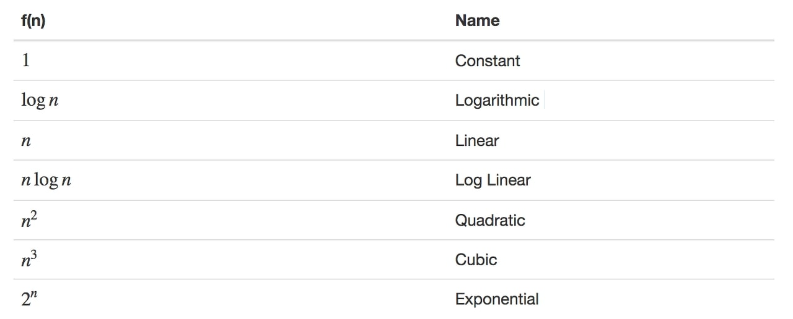
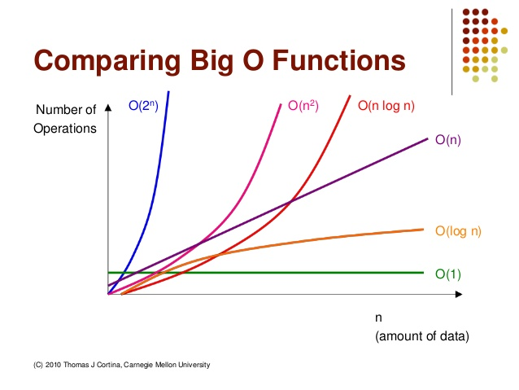

# 시간복잡도와 Big-O 표기법 (Time Complexity & Big-O)
*written by sohyeon, hyemin 💡*

<br>

## 1. 알고리즘의 분석과 수행시간

### 1-1. 알고리즘의 분석

알고리즘을 실행하는데 필요한 자원을 예측하는 것  
메모리, 통신대역, 하드웨어와 같은 자원이 측정의 관심대상이 되기도 하지만  
대부분의 경우 측정대상은 계산시간이다.  

#### 수행시간

기본연산개수 또는 실행된 단계의 횟수  
(즉, 알고리즘의 수행시간은 각 명령문 수행시간의 합이다.)  

#### 알고리즘 수행시간

주어진 문제의 입력크기가 다양하기 때문에  
`최악`, `최상`, `평균`적인 경우 총 3개의 case를 가질 수 있는데  
우리는 `최악`의 경우에 주로 관심을 둘 것이다.  

    최악의 경우는 모든 입력에 대한 수행시간의 상한이 되며,
    이보다 더 나쁜 경우는 존재하지 않고 최악의 경우가 빈번하기도 함  

### 1-2. 시간복잡도

가장 널리 사용되는 알고리즘의 수행시간 기준  
알고리즘이 실행되는 동안 수행하는 기본적인 연산의 수를 입력의 크기에 대한 함수로 표현  

    <시간 복잡도와 입력 크기의 관계>

    시간 복잡도가 높다는 것은 입력의 크기가 증가할 때 알고리즘의 수행 시간이 증가한다는 의미이다.  
    하지만 시간 복잡도가 낮다고 해서 언제나 더 빠르게 동작하는 것은 아니다.  
    입력의 크기가 작을 때는 시간 복잡도가 높은 알고리즘이 더 빠르게 동작할 수도 있다.


시간 복잡도를 표기하기 쉽게하기 위해 증가차수, 점근적 효율성을 기준으로 알고리즘의 수행시간을 나타낼 것이다.

#### 증가차수

더 단순하게 추상화하여 수행시간에 대한 증가비율 또는 증가차수를 이용하는 것  
차수가 가장 높은 항만 고려하고 상수 계수는 무시한다.  

#### 점근적 효율성

입력크기가 극한으로 증가할 때 어떤 알고리즘의 수행시간이 어떻게 증가하는지에 관심을 두고  
점근적으로 더 효율적인 알고리즘이 가장 좋은 선택이 되는 것  

점근적 표기 방식에 따라,

* 최상의 경우 : 오메가 표기법 (Big-Ω Notation)

* 평균의 경우 : 세타 표기법 (Big-θ Notation)

* 최악의 경우 : 빅오 표기법 (Big-O Notation)

세가지 방식으로 시간복잡도를 나타내는데 사용한다.  
이 중에서도 최악의 경우인 빅오를 사용해 최악의 경우를 판단하면 평균과 가까운 성능으로 예측하기 쉽다.  

## 2. 빅오 표기법(Big-O Notation)

빅오 표기법은 점근적 상한을 나타내는 것이다.  
입력의 크기가 극한으로 증가할때 최고 차항의 차수가 가장 영향을 많이 끼치기 때문에  
가장 높은 항을 제외하고 다른 항은 다 제거하는 표기법이다.

즉, 시간복잡도에 가장 큰 영향을 미치는 차항으로 시간복잡도를 나타내는 표기법이다.  

```
T(n)=n^2+2n+9 	    # O(n2)

T(n)=n^4+n^3+n^2+1  # O(n4)

T(n)=5n^3+3n^2+2n+1 # O(n3)
```

최고 차항을 제외하고 다 제거하고 계산하기 때문에 계산이 매우 간단하다.  
알고리즘의 시간복잡도는 반복문에 의해 결정되므로 반복문이 몇번 실행되는지 보면 된다.  

#### 예시)

```Java
for(int i=0; i<N; i++){
	...
    for(int k=0; k<N; k++){
    	...
    }
}
```
위와 같은 경우 N번 수행되는 반복문이 두번 중첩되어있기 때문에 시간복잡도는 `O(N^2)`이다.

### 2-1. Big-O 표기법의 종류와 성능

### 1) Big-O 표기법의 종류



* O(1) - (상수) Constant

    - 입력되는 데이터양과 상관없이 일정한 실행 시간을 가진다.  
    - 알고리즘이 문제를 해결하는데 오직 한 단계만 거친다.  

* O(logN) Logarithmic

    - 데이터양이 많아져도, 시간이 조금씩 늘어난다.  
    - 시간에 비례하여, 탐색 가능한 데이터양이 2의 n승이 된다.  
    - 문제를 해결하는데 필요한 단계들이 연산마다 특정 요인에 의해 줄어든다.  
    - 만약 입력 자료의 수에 따라 실행시간이 이 log N 의 관계를 만족한다면
      N이 증가함에 따라 실행시간이 조금씩 늘어난다.  
    - 이 유형은 주로 커다란 문제를 일정한 크기를 갖는 작은 문제로 쪼갤때 나타나는 유형이다.  
    
    - 예시: Binary Search

* O(N) Linear

    - 데이터양에 따라 시간이 정비례한다.  
    - linear search, for 문을 통한 탐색을 생각하면 되겠다.  

* O(N log N) log linear

    - 데이터양이 N배 많이 진다면, 실행 시간은 N배 보다 조금더 많아 진다. (정비례 하지 않는다)  
    - 이 유형은 커다란 문제를 독립적인 작은 문제로 쪼개어 각각에 대해 독립적으로 해결하고,
      나중에 다시 그것들을 하나로 모으는 경우에 나타난다.  
    - N이 두배로 늘어나면 실행 시간은 2배보다 약간 더 많이 늘어난다.  

    - 예시: 퀵소트, 머지소트 

* O(N^2) Quadratic

    - 데이터양에 따라 걸리는 시간은 제곱에 비례한다. (효율이 좋지 않음, 사용하면 안된다)  
    - 이 유형은 이중루프내에서 입력 자료를 처리 하는 경우에 나타난다.  
    - N값이 큰값이 되면 실행 시간은 감당하지 못할 정도로 커지게 된다.  
    - 문제를 해결하기 위한 단계의 수는 입력값 n의 제곱

    - 예시: 2중 for 문을 사용하는 버블소트, 삽입정렬(insertion sort)

### 2) 성능비교



성능 순서 : O(1)<O(logn)<O(n)<O(nlogn)<O(n2)<O(n3)<O(2n)  
    
