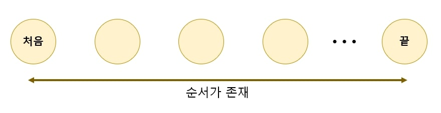
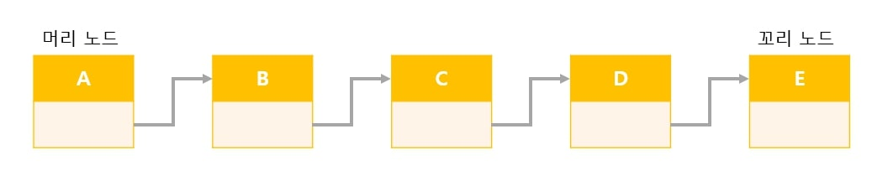
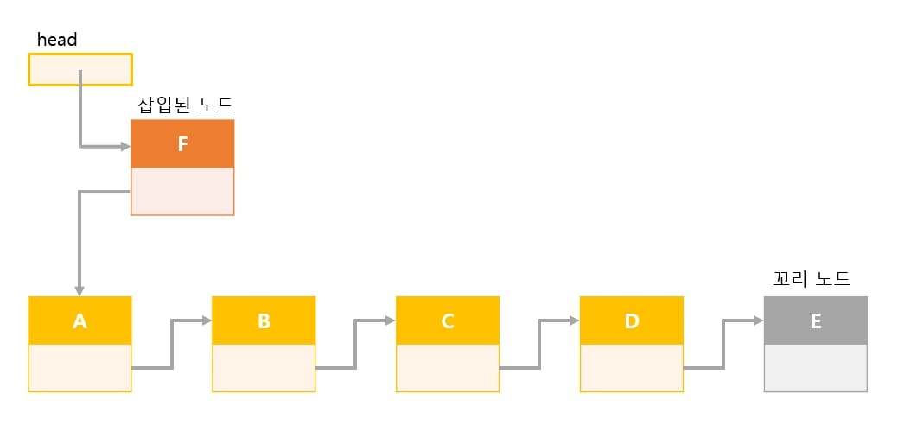
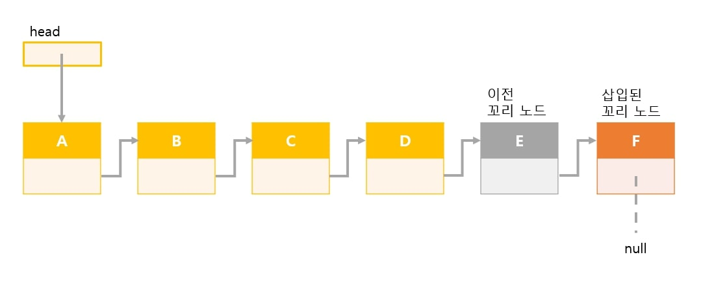
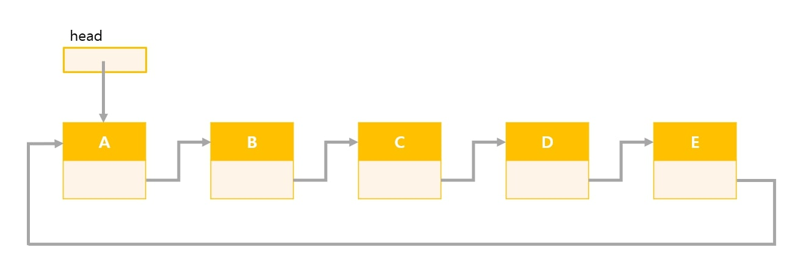
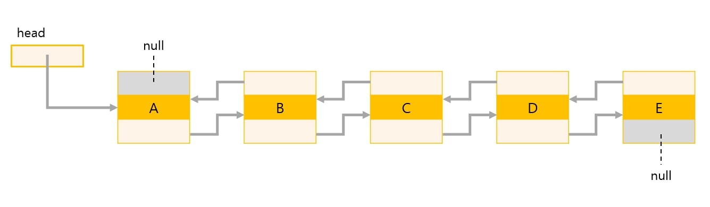

# 연결리스트 (LinkedList)
*written by sohyeon, hyemin 💡*

<br>

## 1. 연결 리스트란?

먼저, `리스트`는 데이터를 순서대로 나열한 자료구조이다. 

  

위의 그림 처럼 순서가 있으며 각각의 데이터가 나열되어 있는 형태이다.

`연결 리스트`는 나열된 불연속적인 데이터를 서로 연결한 형태이다.  



각 노드가 데이터와 포인터를 가지고 한 줄로 연결되어 있는 방식으로 데이터를 저장하고 있다.  
이때 리스트의 데이터는 노드 또는 요소라고 한다.  
각각의 노드는 데이터와 다음 노드를 가리키는 포인터를 가지고 있다. (위의 그림에서 회색 선)  

하나의 노드를 기준으로 바로 앞에 있는 노드를 `앞쪽 노드(predecessor node)`, 바로 뒤에 있는 노드를 `다음 노드(successor node)`라고 한다.  

    < 배열의 단점 >
        
    - 크기를 변경할 수 없다.
    - 비순차적인 데이터의 추가, 삭제에 시간이 많이 걸린다.  
      (배열 중간 데이터를 추가하려면 빈자리를 만들기 위해 데이터 복사, 이동 과정이 필요하다.)

    -> 연결 리스트는 이러한 배열의 단점을 보완한다.
       배열처럼 데이터를 복사, 이동하는 과정 없이 노드 간의 참조 변경만으로 데이터 추가, 삭제가 가능하다.  

## 2. 연결 리스트 만들기

포인터를 활용하는 방법을 기준으로 작성하겠습니다.

### 2-1. 노드 만들기

노드 객체에는 데이터와 다음 노드를 가리키는 포인터가 존재한다.

```Java
class Node<E>{
  E data;       // 데이터
  Node<E> next; // 다음 노드를 가리키는 포인터
}
```

`next`는 자기 자신과 같은 클래스형의 인스턴스를 참조하기 위한 참조형 필드이다.  
Node<E>는 제네릭으로 구현되므로 데이터 형 E는 임의의 클래스형이 허용된다.  
필드 data형인 E는 참조형이라는 것에 유의하자.  

### 2-2. 연결 리스트 클래스

```Java
import java.util.Comparator;

public class LinkedList<E>{
  //노드
  class Node<E>{
    E data;
    Node<E> next;

    //생성자
    Node(E data, Node<E> next){
      this.data = data;
      this.next = next;
    }
  }

  private Node<E> head;   //머리 노드
  private Node<E> crnt;   //선택 노드
}
```

#### 생성자

```Java
public LinkedList(){
  head = crnt = null;
}
```

노드가 하나도 없는 비어 있는 연결리스트를 생성 

* 연결리스트가 비어 있는 경우
  - head == null

* 노드가 한개인 연결 리스트
  - head.next == null

* 꼬리 노드인지 판단
  - p.next == null

### 2-3. 메소드

#### 1) 데이터 검색 (Search)

`search`메서드는 검색할 노드를 만날 때까지 머리노드부터 순서대로 리스트의 노드들을 스캔한다.  
검색할 노드를 찾지 못하고 꼬리 노드를 지나기 직전인 경우나 검색 조건을 만족해 노드를 찾은 경우 종료된다.  

```Java
public E search(E obj, Comparator<? super E> c){
  Node<E> ptr = head;

  while(ptr!=null){
    if(c.compare(obj, ptr.data)==0){ // 검색 성공
      crnt = ptr;
      return ptr.data;
    }
    ptr = ptr.next;                  // 다음 노드 선택
  }
  return null;                       // 검색 실패
}
```

#### 2) 데이터 삽입

#### 머리에 노드를 삽입



삽입 전의 머리 노드(A)에 대한 포인터를 ptr에 대입하고  
삽입 될 새로운 노드(F)를 생성, 노드의 데이터는 obj, 포인터가 가리키는 곳은 ptr이 된다.  
생성한 노드를 참조하도록 head를 업데이트

#### 꼬리에 노드를 삽입



리스트가 비어있는지 아닌지를 확인하고 작업을 수행   

  - 리스트가 비어있을 경우

    머리에 노드를 삽입 하는 것과 동일  
  
  - 리스트가 비어 있지 않은 경우

    리스트 꼬리에 새로운 노드를 삽입  

#### 코드

```Java
//머리에 노드 삽입
public void addFirst(E obj){
  Node<E> ptr = head;
  head = crnt = new Node<E>(obj, ptr);
}

//꼬리에 노드 삽입
public void addLast(E obj){
  if(head == null)
    addFirst(obj);
  else{
    Node<E> ptr = head;
    while(ptr.next!=null)   // while문 종료시 ptr은 꼬리 노드를 가리킴
      ptr = ptr.next;
    ptr.next = crnt = new Node<E>(obj, null);
  }
}
```

#### 3) 데이터 삭제

#### - 머리 노드 삭제


리스트에 노드가 한개만 있어도 오류없이 삭제 가능

#### - 꼬리 노드 삭제


리스트에 노드가 몇개 있는지에 따라 해당 작업을 수행  
* 리스트에 노드가 1개인 경우

  머리 노드를 삭제하는 작업과 같음

* 리스트에 노드가 2개 이상인 경우

  꼬리 노드와 꼬리 노드로부터 두번째 노드를 찾는다.  
  꼬리 노드로부터 두번째 노드의 뒤쪽 포인터에 null을 대입  
  어디에도 참조되지 않을 꼬리노드는 자동으로 해지 될 것  

#### 코드

```Java
//머리 노드 삭제
public void removeFirst(){
  if(head!=null)
    head = crnt = head.next;
}

//꼬리 노드 삭제
public void removeLast(){
  if(head!=null){
    if(head.next==null)
      removeFirst();
  }
  else{
      Node<E> ptr = head;   // 스캔 중인 노드
      Node<E> pre = head;   // 스캔 중인 노드의 앞쪽 노드

      while(ptr.next!=null){
        pre = ptr;
        ptr = ptr.next;
      }
      pre.next = null;    // pre는 삭제 작업 후의 꼬리 노드
      crnt = pre;
  }
}
```

#### - 선택한 노드 삭제


선택한 노드가 머리 노드인지 아닌지에 따라 작업을 수행  

* p가 머리 노드인 경우

  머리 노드를 삭제

* p가 머리 노드가 아닌 경우

  p의 앞쪽 노드를 찾는다. (ptr이 참조하게 됨)  
  p의 뒤쪽 포인터 `p.next`를 ptr의 `ptr.next`에 대입  
  ptr의 뒤쪽 포인터가 p의 다음 노드를 참조하도록 업데이트 한다.  
  어디에도 참조되지 않는 노드 p의 메모리는 자동으로 해지된다.  

(p는 삭제되기 위해 선택된 노드이다.)

#### 코드

```Java
//노드 p 삭제
public void remove(Node p){
  if(head!=null){
    if(p==head)
      removeFirst();
  }
  else{
    Node<E> ptr = head;

    while(ptr.next!=p){
      ptr = ptr.next;
      if(ptr==null) return;   // p가 리스트에 없음
    }
    ptr.next = p.next;
    crnt = ptr;
  }
}

//선택 노드를 삭제
public void removeCurrentNode(){
  remove(crnt);
}

//모든 노드 삭제
public void clear(){
  while(head!=null)   //노드에 아무것도 없을 때 까지 머리노드를 삭제
    removeFirst();
  crnt = null;
}
```

## 3. 원형 이중 연결 리스트

### 3-1. 원형 리스트



연결 리스트의 꼬리 노드가 머리 노드를 가리키는 구조의 리스트  
고리 모양으로 나열된 데이터를 저장할 때 알맞은 자료구조  

### 3-2. 이중 연결 리스트



연결 리스트의 가장 큰 단점은 다음 노드는 찾기 쉽지만 앞쪽의 노드는 찾을 수 없다는 점 이다.  
이 단점을 개선한 자료구조가 `이중 연결 리스트`이다.  

`이중 연결 리스트`의 노드는 두 개의 포인터 공간이 있다.  
각각의 포인터는 앞의 노드와 뒤의 노드를 가리킨다.  

```Java
class Node<E>{
  E data;
  Node<E> prev; // 머리 노드를 가리킴
  Node<E> next; // 꼬리 노드를 가리킴
}
```

### 3-3. 원형 이중 연결 리스트


원형 리스트와 이중 연결 리스트의 개념이 합해진 구조의 리스트이다.  

<br>

## Reference & Additional Resources

* Do it! 자료구조와 함께 배우는 알고리즘 입문  
( 책을 기반으로 공부한 내용을 정리한 것입니다.)

* 이미지 - 직접 제작  
