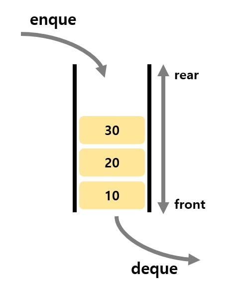
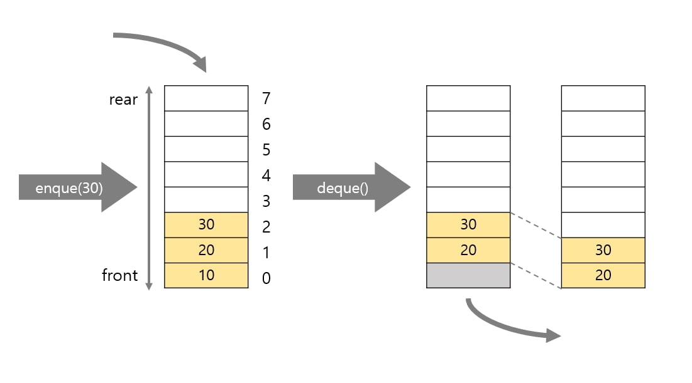
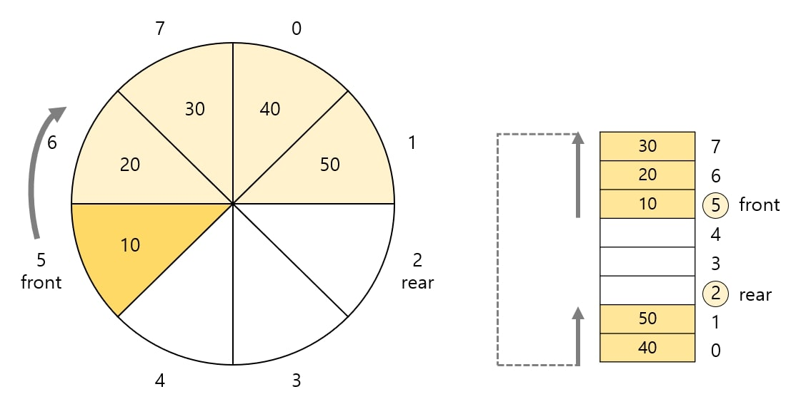

# 큐 (Queue)
*written by sohyeon, hyemin 💡*

<br>

## 1. 큐란?

`큐`는 데이터를 일시적으로 쌓아 두기 위한 자료구조이다.  
입출력 순서는 가장 먼저 넣은 데이터를 가장 먼저 꺼내는 `선입선출`구조를 따른다.  



    생활에서 볼 수 있는 큐의 예시로는,
    은행 창구에서의 차례를 기다리는 대기, 마트 계산을 위해 기다리는 대기열을 들 수 있다.

## 2. 배열로 큐 만들기

큐는 배열을 사용하여 구현할 수 있다. 배열을 사용한 큐에 대한 예시이다.  

### 2-1. 클래스와 생성자

```Java
public class IntQueue{
	private int max; // 큐의 용량
	private int front; // 맨 앞 커서
	private int rear; // 맨 뒤 커서
	private int num; // 현재의 데이터 수
	private int[] que; // 큐의 본체

	// 실행할 때 예외：큐가 비어 있음
	public class EmptyIntQueueException extends RuntimeException {
		public EmptyIntQueueException() {
		}
	}

	// 실행할 때 예외：큐가 가득 참
	public class OverflowIntQueueException extends RuntimeException {
		public OverflowIntQueueException() {
		}
	}

	// 생성자
	public IntQueue(int capacity) {
		num = front = rear = 0;
		max = capacity;
		try {
			que = new int[max]; // 큐 본체용 배열을 생성
		} catch (OutOfMemoryError e) { // 생성할 수 없습니다.
			max = 0;
		}
    }
}
```

생성 시 큐는 비어 있으므로 스택 포인터 num, front, rear 모두 0으로 한다.   
매개변수 capacity로 전달받은 값을 스택 용량을 나타내는 max에 복사하고   
요솟수가 max인 배열 que의 본체를 생성한다.  

### 2-2. 메서드

### 1) 데이터 추가, 삭제



### 데이터 추가 - enque

rear의 데이터가 저장된 요소 다음에 데이터를 추가하는 메서드이다.  
큐가 가득차서 enque 할 수 없는 경우 예외 `OverflowIntQueueException`을 throw한다.  
전달받은 데이터를 넣을 수 있으면 `que[rear++]`에 저장하고, 현재 데이터 수 num을 증가 시킨다.  
메서드의 반환값은 enque한 값이다.  

```Java
public int enque(int x) throws OverflowIntQueueException {
	if (num >= max)
		throw new OverflowIntQueueException(); // 큐가 가득 참
	que[rear++] = x;
	num++;
	if (rear == max)
		rear = 0;
	return x;
}
```

### 데이터 삭제 - deque

front에 위치한 맨 앞의 요소를 꺼낸 다음 그 이후의 요소를 앞으로 옮기는 메서드이다.  
큐가 비어 있어 deque 할 요소가 없는 경우 예외 `EmptyIntQueueException`을 throw한다.  

```Java
public int deque() throws EmptyIntQueueException {
	if (num <= 0)
		throw new EmptyIntQueueException(); // 큐가 비어 있음
	int x = que[front++];
	num--;
	if (front == max)
		front = 0;
	return x;
}
```

### 3) 그 외

* peek : front에 있는 값을 보는 메서드이다.

* indexOf : 배열 que에 x와 같은 값의 데이터가 포함되어 있는지,  
            포함되어 있다면 배열의 어디에 들어 있는지를 조사하는 메서드이다.  

* clear : 큐의 모든 데이터를 삭제하는 메서드

* capacity : 용량을 확인하는 메서드

* size : 현재 큐에 쌓여있는 데이터 수를 반환하는 메서드

* isEmpty : 큐가 비어 있는지 검사하는 메서드

* isFull : 큐가 가득 찼는지 검사하는 메서드

```Java
// 큐에서 데이터를 피크(머리데이터를 살펴봄)
public int peek() throws EmptyIntQueueException {
	if (num <= 0)
		throw new EmptyIntQueueException(); // 큐가 비어 있음
	return que[front];
}

// 큐에서 x를 검색하여 index(찾지 못하면 -1)를 반환
public int indexOf(int x) {
    for (int i = 0; i < num; i++) {
        int idx = (i + front) % max;
        if (que[idx] == x) // 검색성공
            return idx;
    }
    return -1; // 검색실패
}

// 큐를 비움
public void clear() {
    num = front = rear = 0;
}

// 큐의 용량을 반환
public int capacity() {
    return max;
}

// 큐에 쌓인 데이터 수를 반환
public int size() {
    return num;
}

// 큐가 비어 있는가?
public boolean isEmpty() {
    return num <= 0;
}

// 큐가 가득 찼는가?
public boolean isFull() {
    return num >= max;
}

// 큐 안의 터(이터를 머리→꼬리의 차례로 나타냄
public void dump() {
    if (num <= 0)
        System.out.println("큐가 비었습니다.");
    else {
        for (int i = 0; i < num; i++)
            System.out.print(que[(i + front) % max] + " ");
        System.out.println();
    }
}
```

## 3. 링 버퍼로 큐 만들기

`링 버퍼`는 배열의 처음이 끝과 연결되어있는 자료구조이다.  
`링 버퍼`를 활용하면 배열요소를 앞쪽으로 옮기는 작업이 불필요하다.  
논리적으로 첫번째 요소와 마지막 요소를 식별하기 위해 `front`와 `rear`변수가 존재한다.  



* front : 맨 처음 요소의 인덱스
* rear : 맨 끝 요소의 하나 뒤의 인덱스 (다음 요소를 인큐할 위치를 미리 지정)

### 3-1. 클래스와 생성자

```Java
public class IntQueue{
	private int max;      // 큐의 용량
	private int front;    // 첫번째 요소 커서
	private int rear;     // 마지막 요소 커서
	private int num;      // 현재 데이터 수
	private int[] que;    // 큐 본체

	// 실행 시 예외: 큐가 비어 있음
	public class EmptyIntQueueException extends RuntimeException{
		public OverflowIntQueueException(){}
	}

	// 실행 시 예외 : 큐가 가득 차 있음
	public class OverflowIntQueueException extends RuntimeException{
		public OverflowIntQueueException(){}
	}

	// 생성자
	public IntQueue(int capacity){
		num = front = rear = 0;
		max = capacity;
		try{
			que = new int[max];
		} catch(OutOfMemoryError e){
			max = 0;
		}
	}
}
```

- `front`와 `rear`의 값이 같을 때 큐의 상태는 비어있거나 가득찬 상태이다.  
   이 조건만으로 구분을 할 수 없다. 
- `front`와 `rear`의 값이 같을 경우, 큐의 상태를 구분하기 위해 `num`변수를 활용  
   큐가 비었을 때 `num`은 0이고 큐가 가득 찼을때 `num`은 max의 값과 같다.    

### 3-2. 메서드

### 1) enque

큐에 데이터를 인큐하고 인큐된 값을 반환하는 메서드이다.  
rear의 위치에 요소를 추가하고 rear와 num값을 1만큼 증가한다.  

인큐하기 전 rear의 값이 max-1 값이라면 enque 수행 후 rear값이 max와 같아지게 되는 문제가 발생한다.  
이를 방지하기 위해 rear값이 1만큼 증가했을 때 max와 같아지는 경우 rear를 배열의 처음인 0으로 변경한다.  

```Java
public int enque(int x) throws OverflowIntQueueException {
	if(num>=max)
		throw new OverflowIntQueueException();
	que[rear++] = x;
	num++;
	if(rear == max)
		rear = 0;
	return x;
}
```

### 2) deque

큐에서 데이터를 디큐하고 그 값을 반환하는 메서드이다.  
front에 저장된 값을 꺼내고 front값을 1만큼 증가한 다음 num을 1만큼 감소시킨다.  

디큐하기 전 front값이 배열의 끝이라면 디큐 수행 이후에 front값이 max가 되는 문제가 발생한다.  
이를 방지하기 위해 front값이 1만큼 증가했을 때 max와 같아지면 front값을 배열의 처음인 0으로 변경한다.  

```Java
public int deque() throws EmptyIntQueueException{
	if(num<=0)
		throw new EmptyIntQueueException();
	int x = que[front++];
	num--;
	if(front == max)
		front = 0;
	return x;
}
```

### 3) 그 외

```Java
// 큐에서 데이터를 피크 (프런트 데이터를 들여다봄)
public int peek() throws EmptyIntQueueException {
	if (num <= 0)
		throw new EmptyIntQueueException();				// 큐가 비어 있음
	return que[front];
}

// 큐에서 x를 검색하여 인덱스(찾지 못하면 –1)를 반환
public int indexOf(int x) {
	for (int i = 0; i < num; i++) {
		int idx = (i + front) % max;
		if (que[idx] == x)								// 검색 성공
			return idx;
	}
	return -1;											// 검색 실패
}

// 큐를 비움
public void clear() {
	num = front = rear = 0;
}

// 큐의 용량을 반환
public int capacity() {
	return max;
}

// 큐에 쌓여 있는 데이터 수를 반환
public int size() {
	return num;
}

// 큐가 비어 있나요?
public boolean isEmpty() {
	return num <= 0;
}

// 큐가 가득 찼나요?
public boolean isFull() {
	return num >= max;
}

// 큐 안의 모든 데이터를 프런트 → 리어 순으로 출력
public void dump() {
	if (num <= 0)
		System.out.println("큐가 비어 있습니다.");
	else {
		for (int i = 0; i < num; i++)
			System.out.print(que[(i + front) % max] + " ");
		System.out.println();
	}
}
```

## 4. 덱(양방향 대기열, deque/double ended queue)

시작과 끝 지점, 양쪽에서 데이터를 인큐하거나 디큐하는 자료구조이다.  


### 덱 만들기

```Java
public class IntDeque {
	private int max; // 덱(deck)의 용량
	private int num; // 현재의 데이터 수
	private int front; // 맨 앞 커서
	private int rear; // 맨 뒤 커서
	private int[] que; // 덱(deck)의 본체

	// 실행할 때 예외：큐가 비어 있음
	public class EmptyIntDequeException extends RuntimeException {
		public EmptyIntDequeException() {
		}
	}

	// 실행할 때 예외：큐가 가득 참
	public class OverflowIntDequeException extends RuntimeException {
		public OverflowIntDequeException() {
		}
	}

	// 생성자
	public IntDeque(int capacity) {
		num = front = rear = 0;
		max = capacity;
		try {
			que = new int[max]; // 덱(deck)본체용 배열을 생성
		} catch (OutOfMemoryError e) { // 생성할 수 없습니다
			max = 0;
		}
	}

	// 덱(deck)에 데이터를 머리쪽부터 인큐
	public int enqueFront(int x) throws OverflowIntDequeException {
		if (num >= max)
			throw new OverflowIntDequeException(); // 덱(deck)이 가득 참
		num++;
		if (--front < 0)
			front = max - 1;
		que[front] = x;
		return x;
	}

	// 덱(deck)에 데이터를 꼬리쪽부터 인큐
	public int enqueRear(int x) throws OverflowIntDequeException {
		if (num >= max)
			throw new OverflowIntDequeException(); // 덱(deck)은 가득 참
		que[rear++] = x;
		num++;
		if (rear == max)
			rear = 0;
		return x;
	}

	// 덱(deck)의 머리부터 데이터를 디큐
	public int dequeFront() throws EmptyIntDequeException {
		if (num <= 0)
			throw new EmptyIntDequeException(); // 덱(deck)이 비어 있음
		int x = que[front++];
		num--;
		if (front == max)
			front = 0;
		return x;
	}

	// 덱(deck)의 꼬리부터 데이터를 디큐
	public int dequeRear() throws EmptyIntDequeException {
		if (num <= 0)
			throw new EmptyIntDequeException(); // 덱(deck)이 비어 있음
		num--;
		if (--rear < 0)
			rear = max - 1;
		return que[rear];
	}

	// 덱(deck)의 머리부터 데이터를 피크(머리데이터를 살펴봄)
	public int peekFront() throws EmptyIntDequeException {
		if (num <= 0)
			throw new EmptyIntDequeException(); // 덱(deck)이 비어 있음
		return que[front];
	}

	// 덱(deck)의 꼬리부터 데이터를 피크(꼬리데이터를 살펴봄)
	public int peekRear() throws EmptyIntDequeException {
		if (num <= 0)
			throw new EmptyIntDequeException(); // 덱(deck)이 비어 있음
		return que[rear == 0 ? max - 1 : rear - 1];
	}

	// 덱(deck)에서 x를 검색하여 index(찾지 못하면 -1)를 반환
	public int indexOf(int x) {
		for (int i = 0; i < num; i++)
			if (que[(i + front) % max] == x) // 검색성공
				return i + front;
		return -1; // 검색실패
	}

	// 덱(deck)에서 x를 검색하여 머리부터 몇 번 째인가(찾지 못하면 0)를 반환
	public int search(int x) {
		for (int i = 0; i < num; i++)
			if (que[(i + front) % max] == x) // 검색성공
				return i + 1;
		return 0; // 검색실패
	}

	// 덱(deck)을 비움
	public void clear() {
		num = front = rear = 0;
	}

	// 덱(deck)의 용량을 반환
	public int capacity() {
		return max;
	}

	// 덱(deck)에 쌓인 데이터 수를 반환
	public int size() {
		return num;
	}

	// 덱(deck)이 비어 있는가?
	public boolean isEmpty() {
		return num <= 0;
	}

	// 덱(deck)이 가득 찼는가?
	public boolean isFull() {
		return num >= max;
	}

	// 덱(deck)내의 데이터를 머리→꼬리의 차례로 나타냄
	public void dump() {
		if (num <= 0)
			System.out.println("덱(deck)이 비었습니다.");
		else {
			for (int i = 0; i < num; i++)
				System.out.print(que[(i + front) % max] + " ");
			System.out.println();
		}
	}
}
```
