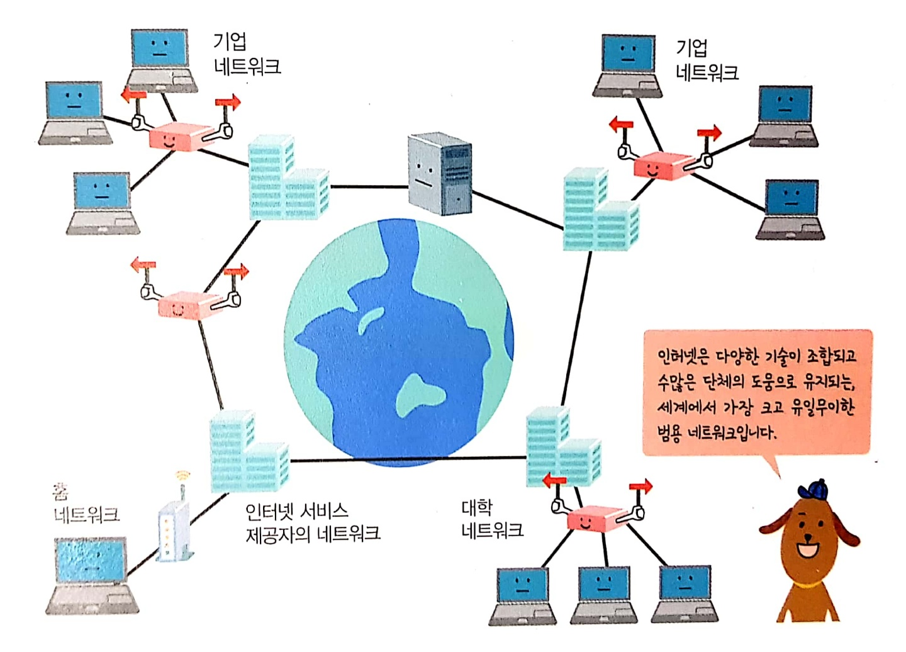

# 컴퓨터 네트워크
*written by sohyeon, hyemin 💡*

<br>

## 1. 컴퓨터 네트워크란?
`컴퓨터 네트워크`는 여러 대의 컴퓨터를 서로 연결하여 서로 데이터를 주고받을 수 있도록 망이 사전에 구축된 것을 말한다.  

* **LAN(Local Area Network)**  
가정이나 사무실처럼 실내에서 비교적 근거리에 위치한 컴퓨터들이 연결한 것을 말한다.
  
* **WAN(Wide Area Network)**  
집 밖이나 회사 건물 밖처럼 비교적 먼 거리에 위치한 컴퓨터들과 연결한 것을 말한다.

### 전 세계의 컴퓨터를 연결하는 인터넷


`인터넷`은 가장 규모가 큰 네트워크로, 인터넷을 통해 서로 다른 네트워크에 속해 있더라도 데이터를 주고받을 수 있다.  

### 모바일 네트워크
`모바일 네트워크`는 휴대전화나 스마트폰을 연결하기 위해 무선 기술을 활용한 네트워크를 말한다.  

### 컴퓨터 네트워크의 역할
이메일, 채팅, VoIP(인터넷 전화), 파일 공유, 주변 기기의 공유, 분산 처리, 파일 전송, 원격 제어, WWW(웹), 동영상 및 음악 스트리밍 서비스 등이 있다.

<br>

## 2. 서버와 클라이언트
`서버(Server)`는 네트워크에 연결된 컴퓨터들 중 서비스를 제공하는 쪽을 말한다.  
`클라이언트(Client)`는 그 서비스를 받는 쪽을 말한다.

### 서비스별 서버와 클라이언트의 역할
  
| 서비스 이름 | 서버의 역할 | 클라이언트의 역할 |
|:---:|:---:|:---:|
| 웹 서비스 | 클라이언트로부터 요청을 받고 해당하는 웹 페이지를 전송한다. | 서버에 웹 페이지를 요청하고 응답으로 받은 웹 페이지를 화면에 표시한다. |
| 메일 서비스 | 메일을 전달하는 송신 기능과 받은 메일을 저장하는 수신 기능이 있다. | 사용자가 작성한 메일을 메일 서버로 보내고 다른 사람이 보낸 메일을 받아 화면에 표시한다. 
| FTP 서비스 | 서버 컴퓨터의 하드 디스크 폴더 안으로 업로드한 파일을 저장하는 기능과 하드 디스크 폴더 안에 있는 파일을 다운로드하는 기능이 있다. | 클라이언트 PC에 저장된 파일을 서버에 업로드하거나 서버의 파일을 클라이언트 PC에 다운로드한다. |
| 원격 제어 서비스 | 클라이언트가 내린 명령을 서버에서 실행하고 그 결과를 클라이언트에게 보여준다. | 사용자의 제어 명령을 원격지의 서버에 전달하고 그 결과를 받아 화면에 표시한다. |

### 피어 투 피어 
네트워크에 연결된 두 대의 컴퓨터가 클라이언트와 서버의 역할을 동시에 할 수 있어서 서로에게 서비스를 주거나 받을 수 있는 통신 방식이다.

<br>

## 3. 패킷 교환 방식
### 패킷 교환 방식이란?
이메일이나 파일과 같은 데이터를 `패킷(Packet)`이라는 작은 단위로 분할한 후 주고받는다.  

### 회선 교환 방식과 패킷 교환 방식
* **회선 교환 방식**
    * 통신하려는 양측을 연결하기 위해 하나의 통신 경로를 점유한 후 통신하는 방식이다.  
    * 일대일 통신이며, 통신 속도가 안정적이라는 장점이 있다. 
    
* **패킷 교환 방식**
    * 주고받을 데이터를 작게 쪼갠 후 다른 데이터의 조각들과 통신 경로를 공유하며 전송하는 방식이다.
    * 여러 상대와 통신할 때 효과적이지만, 주고받는 패킷이 많아지면 전송 속도가 느려질 수 있다. 

<br>

## 4. TCP/IP 계층 모델


### 애플리케이션 계층
`애플리케이션 계층`의 역할은 사용자가 실제로 체감할 수 있는 서비스를 제공하는 것이다.  
애플리케이션 계층의 프로그램은 데이터의 내용을 보고 그에 맞는 서비스를 처리하는 데 집중하고 데이터 전송에 대해서는 하위 계층에 위임합니다.  

#### 애플리케이션 계층의 과정
```
1. 클라이언트 PC는 보고 싶은 웹 페이지의 URL을 요청한다.
2. 웹 서버 컴퓨터는 웹 페이지의 HTML 데이터를 응답한다.
3. 클라이언트 PC는 응답으로 받은 HTML 데이터를 해석하여 웹 페이지 형태로 표시한다. 
```

### 트랜스포트 계층
`트랜스포트 계층`의 역할은 애플리케이션 계층의 프로그램에서 전달받은 데이터를 목적지 애플리케이션 계층의 프로그램까지 전달하는 것이다.  
데이터가 제대로 전달되지 않았을 때 재전송하는 것도 이 계층이 하는 일이다.  


#### 트랜스포트 계층의 과정
```
1. 클라이언트 PC는 어떤 프로그램들이 서로 통신을 해야 하는지에 대한 정보를 헤더에 기록한다.
2. 웹 서버 컴퓨터는 포트 번호를 확인하고 웹 서버에 데이터를 전달한다.
3. 웹 서버 컴퓨터는 요청을 보낸 프로그램을 목적지로 설정하여 응답 데이터를 전달한다. 
```
### 인터넷 계층
`인터넷 계층`의 역할은 데이터에 어드레스 정보를 덧붙여 목적지까지 무사히 전달하는 것이다.  
인터넷 통신에서는 목적지 컴퓨터까지 도달할 수 있는 경로를 찾아야 하는데, 이때 라우터라는 장비가 사용된다.  

#### 인터넷 계층의 과정
```
1. 클라이언트 PC는 통신하는 컴퓨터들을 식별할 수 있도록 어드레스 정보를 덧붙인다.
2. 웹 서버 컴퓨터는 자신이 수신해야 하는 데이터라고 판단되면 트랜스포트 계층에 데이터를 전달한다.
3. 웹 서버 컴퓨터는 클라이언트 PC를 목적지로 설정하여 데이터를 전달한다.
4. 클라이언트 PC는 자신이 수신해야 하는 데이터라고 판단되면 트랜스포트 계층에 데이터를 전달한다. 
```
### 네트워크 인터페이스 계층
`네트워크 인터페이스 계층`의 역할은 유선 LAN 어댑터나 무선 LAN 어댑터가 처리할 수 있는 형태로 데이터를 변환하고 이 데이터를 목적지까지 전달하는 것이다.  
네트워크 인터페이스 계층은 물리적으로 인접하여 연결된 장비까지 어떻게 하면 데이터를 잘 전달할까에 초점을 맞추고 있다.  

#### 네트워크 인터페이스 계층의 과정
```
1. 클라이언트 PC는 주변 장치까지 데이터를 전달하는 데 필요한 정보를 덧붙인다.
2. 웹 서버 컴퓨터는 자신이 수신해야 하는 데이터라고 판단되면 인터넷 계층에 데이터를 전달한다.
3. 웹 서버 컴퓨터는 주변 장치까지 데이터를 전달하는 데 필요한 정보를 덧붙인다.
4. 클라이언트 PC는 자신이 수신해야 하는 데이터라고 판단되면 인터넷 계층에 데이터를 전달한다.
```

<br>

## Reference & Additional Resources

> TCP/IP 쉽게, 더 쉽게

