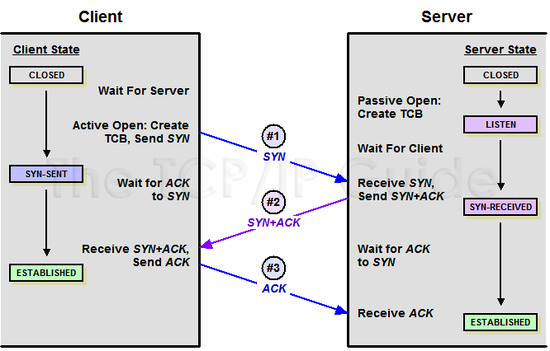
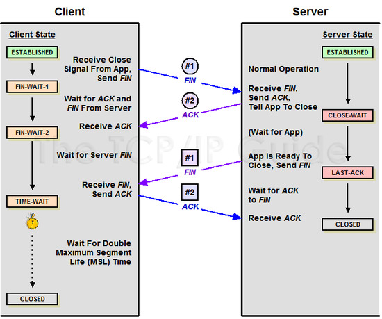

# TCP 3-way handshake와 4-way-handshake
*written by sohyeon, hyemin 💡*

 

## 1. TCP란?
`TCP(Transmission Control Protocol)`는 네트워크 계층 중 전송 계층에서 사용하는 프로토콜로, 트랜스포트 계층의 프로토콜의 하나로 웹이나 이메일, FTP와 같이 정확한 데이터 전달이 필요한 통신에 사용된다.  
`TCP`는 데이터 전송에 신뢰성을 더하기 위해 `데이터를 세그먼트(segment)라는 단위로 분할`하고, `전송 속도를 조절`하며, `데이터가 제대로 전달되지 않았을 경우 재전송`을 하게 된다.  

 

## 2. TCP의 특징
* 인터넷 상에서 데이터를 메시지의 형태로 보내기 위해 IP와 함께 사용하는 프로토콜이다.  
    - TCP와 IP를 함께 사용하는데, IP가 `데이터의 배달을 처리`한다면 TCP는 `패킷을 추적 및 관리`한다.  
  
* 높은 신뢰성을 보장한다.  
  
* UDP와 비교했을 때 속도가 느리다.  
  
* `흐름제어 및 혼잡제어`를 제공한다.
    - `흐름제어`
        * 데이터를 송신하는 곳과 수신하는 곳의 데이터 처리 속도를 조절하여 수신자의 버퍼 오버플로우를 방지한다.  
    - `혼잡제어`
        * 정보의 소통량이 많을 경우 패킷을 조금만 전송하여 혼잡 현상이 일어나는 것을 막는다.  

 

## 3. TCP의 연결 설정 및 해제 과정

### 3-way handshake
TCP 통신을 이용하여 데이터를 전송하기 위해 `네트워크 연결을 설정(Connection Establish) 하는 과정`  
* 즉, TCP/IP 프로토콜을 이용하여 통신을 하는 응용 프로그램이 데이터를 전송하기 전에 먼저 정확한 전송을 보장하기 위해 상대방 컴퓨터와 사전에 세션을 수립하는 과정을 의미한다.  

1. `Client -> Server: SYN`
    * Client가 연결 요청 메시지 전송(SYN)한다.  
    * Client가 최초로 데이터를 전송할 때 Sequence Number를 임의의 랜덤 숫자로 지정하고, SYN 플래그 비트를 1로 설정한 세그먼트를 전송한다.  
    
2. `Server -> Client: SYN + ACK`
    * 접속 요청을 받은 Server가 요청을 수락했으며, Client도 포트를 열어달라는 메시지를 전송(SYN + ACK)한다.  
    * Server는 Acknowledgement Number 필드를 Sequence Number + 1로 지정하고, SYN과 ACK 플래그 비트를 1로 설정한 세그먼트를 전송한다.  

3. `Client -> Server: ACK`
    * 마지막으로 Client가 수락 확인(ACK)을 보내 연결을 맺는다.  
    * 이때, 전송할 데이터가 있으면 이 단계에서 데이터를 전송할 수 있다.  
  
### 4-way handshake
TCP의 `연결을 해제(Connection Termination)하는 과정`

1. `Client -> Server: FIN`
    * Client가 연결을 종료하겠다는 FIN 플래그를 전송한다.  
    * Server가 FIN 플래그로 응답하기 전까지 연결을 계속 유지한다.  
    
2. `Server -> Client: ACK`
    * Server는 일단 확인 메시지를 보내고 자신의 통신이 끝날 때까지 기다린다. 이 상태가 TIME_WAIT 상태다.  
    * Server는 Acknowledgement Number 필드를 Sequence Number + 1로 지정하고, ACK 플래그 비트를 1로 설정한 세그먼트를 전송한다.  
    * 자신이 전송할 데이터가 남아있다면 이어서 계속 전송한다.  
    
3. `Server -> Client: FIN`
    * Server가 통신이 끝났다면 연결 종료 요청에 합의한다는 의미로 Client에게 FIN 플래그를 전송한다.  
    
4. `Client -> Server: ACK`
    * Client는 확인했다는 메시지(ACK)를 전송한다.  
 

### 상태 정보
* `CLOSED`: 포트가 닫힌 상태다.  
* `LISTEN`: 포트가 열린 상태로 연결 요청 대기 중이다.  
* `SYN-RECEIVED`: SYN 요청을 받고 상대방의 응답을 기다리는 중이다.  
* `ESTABLISHED`: 포트 연결 상태다.  
* `TIME_WAIT`: 클라이언트는 서버로부터 FIN을 수신하더라도 일정시간 동안 세션을 남겨놓고 받지 못한 패킷을 기다리는 것을 말한다.  

 

## Reference & Additional Resources
* [[Network] TCP 3-way handshaking과 4-way handshaking](https://gmlwjd9405.github.io/2018/09/19/tcp-connection.html)
* [[네트워크 쉽게 이해하기 22편] TCP 3 Way-Handshake & 4 Way-Handshake](https://mindnet.tistory.com/entry/%EB%84%A4%ED%8A%B8%EC%9B%8C%ED%81%AC-%EC%89%BD%EA%B2%8C-%EC%9D%B4%ED%95%B4%ED%95%98%EA%B8%B0-22%ED%8E%B8-TCP-3-WayHandshake-4-WayHandshake)

