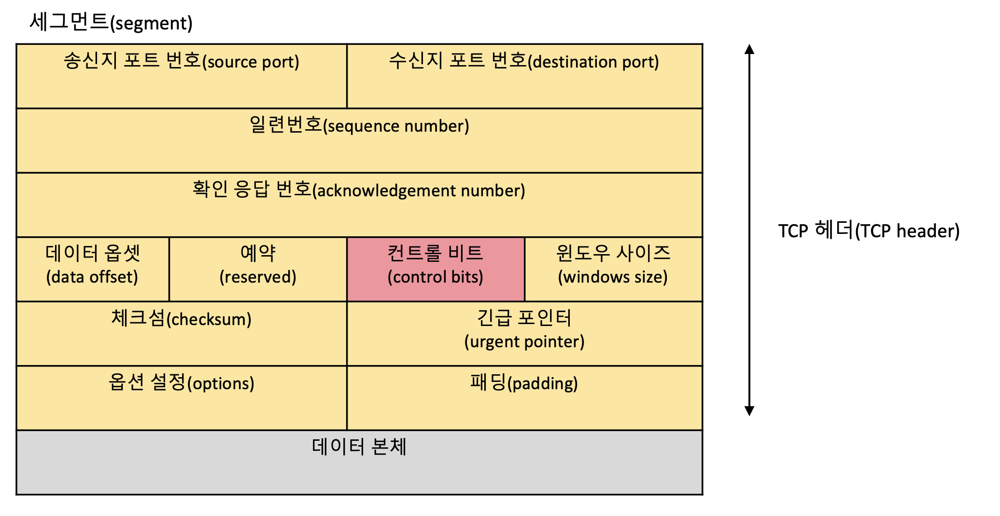

 # TCP와 UDP
*written by sohyeon, hyemin 💡*

 

## 1. TCP(Transmission Control Protocol)

### TCP란?
`TCP(Transmission Control Protocol)`는 인터넷 상에서 데이터를 메시지의 형태로 보내기 위해 IP와 함께 사용하는 프로토콜이다.  
* TCP와 IP를 함께 사용하는데, IP가 `데이터의 배달을 처리`한다면 TCP는 `패킷을 추적 및 관리`한다.  

### TCP의 특징
* TCP는 `신뢰성있는 데이터 전송`을 지원하는 `연결지향형` 프로토콜이다. 
* 데이터 전송에 신뢰성을 더하기 위해 `데이터를 세그먼트(segment)라는 단위로 분할`하고, `전송 속도를 조정`하며, `데이터가 제대로 전달되지 않았을 경우 재전송`을 하게 된다.  
* `흐름 제어와 혼잡 제어를 지원`하며 데이터의 순서를 보장한다.
    - `흐름 제어(flow control)`
        * `흐름 제어`는 `송신 측(호스트)과 수신 측(호스트)의 데이터 처리 속도 차이를 조절`하기 위한 기법이다.  
        * 수신 측은 도착한 패킷들을 버퍼에 쌓아 두는 것과 동시에 이미 버퍼에 쌓인 데이터를 순차적으로 꺼내서 처리하게 된다.  
        * 이때 만약 수신 측 컴퓨터의 성능이 낮다면 `데이터가 들어오는 속도보다 처리하는 속도가 느려져` 문제가 될 수 있다.  
        * 그래서 수신 측은 응답을 보낼 때 `윈도우 사이즈를 설정`하여 `현재 어느 정도까지 수신할 수 있는지`를 수시로 알려주게 된다.  
    - `혼잡 제어`
        * `혼잡 제어`는 `네트워크 내의 패킷 수가 넘치게 증가하지 않도록 방지`하기 위한 기법이다.  
        * 송신 측의 데이터는 지역망이나 인터넷으로 연결된 대형 네트워크를 통해 전달된다.  
        * 만약 하나의 라우터에게 데이터가 몰릴 경우, 라우터는 자신에게 온 데이터를 모두 처리할 수 없다.  
        * 그렇게 되면 호스트들은 또 다시 재전송을 하게 되고 결국 혼잡을 가중시켜 오버플로우나 데이터 손실을 발생시킨다.
        * 따라서, 이러한 네트워크의 혼잡을 피하기 위해 송신 측에서 보내는 데이터의 전송 속도를 강제로 줄이게 된다.
* TCP는 UDP에 비해 속도가 느리다.
* TCP는 가상 회선 방식을 제공한다.
    - 송신 측과 수신 측을 연결하여 패킷을 전송하기 위한 `논리적 경로`를 배정한다.
* 한 메시지가 여러 개의 패킷으로 나누어진 경우 각 패킷들은 서로 다른 경로를 통해 전달될 수 있으며, 그것들은 최종 목적지에서 재조립된다.  
* 웹이나 이메일, FTP와 같이 정확한 데이터 전달이 필요한 통신에 사용한다.  

### TCP 헤더의 구조
TCP의 세그먼트는 데이터 본체에 TCP 헤더가 붙은 형태로 구성된다.  

* `일련번호(sequence number)` : 송신한 바이트 수
* `확인 응답 번호(acknowledgement number)` : 수신한 바이트 수
* `데이터 옵셋(data offset)` : TCP 헤더의 길이
* `윈도우 사이즈(windows size)` : 한 번에 수신할 수 있는 데이터 크기
* `체크섬(checksum)` : 데이터가 훼손되었는지 확인하기 위한 정보

 

## 2. UDP(User Datagram Protocol)

### UDP란?
`UDP(User Datagram Protocol)`는 데이터를 데이터그램 단위로 처리하는 프로토콜이다.  

### UDP의 특징
* UDP는 TCP와 달리 `비연결형` 프로토콜이다.
* 연결을 위해 할당되는 `논리적인 경로`가 없다.  
* 통신 과정에서 데이터의 손실이 발생할 수 있다.
    - VoIP와 같은 음성 서비스나 동영상 스트리밍 서비스는 일부 데이터가 누락되거나 왜곡되더라도 큰 문제가 없기 때문에 UDP를 주로 사용한다.  
* UDP는 TCP와는 달리 메시지를 패킷(데이터그램)으로 나누지만 최종 목적지에서 재조립하지 않는다.
* RTP(Real-Time Protocol), Multicast, 멀티미디어, VoIP, DNS에서 사용한다.

### UDP 헤더 구조
UDP에서는 패킷에 해당하는 것을 `데이터그램`이라고 부른다.  
  
 
  
* `패킷 길이(UDP length)` : 헤더 길이와 데이터 길이의 합계
* `체크섬(checksum)` : 데이터가 훼손되었는지 확인하기 위한 정보

### 브로드캐스트 & 멀티캐스트
TCP에는 없는 기능으로 UDP에는 하나의 패킷을 여러 수신지에 전달하는 `브로드캐스트(broadcast)`와 `멀티캐스트(multicast)`라는 기능이 있다.  
* `브로드캐스트(broadcast)` 
    - local LAN 상에 붙어있는 모든 네트워크 장비들에게 보내는 통신이다.  
    - 통신의 대상이 특정한 한 네트워크가 아니라, 네트워크 안의 모든 장비들에게 통신을 하는 방식이라고 생각하면 된다.  
* `멀티캐스트(multicast)`
    - 보내고자 하는 정보를 그룹 내의 일정 네트워크 장비들에게만 한번에 보낼 수 있는 통신이다.  
    
 

## 3. TCP와 UDP의 차이점
|TCP|UDP|
|:---:|:---:|
| 연결지향형 프로토콜 | 비연결지향형 프로토콜 |
| 바이트 스트림을 통한 연결 | 메시지 스트림을 통한 연결 |
| 혼잡제어, 흐름제어 | 혼잡제어, 흐름제어 지원하지 않음 |
| 순서 보장, 상대적으로 느림 | 순서 보장되지 않음, 상대적으로 빠름 |
| 신뢰성 있는 데이터 전송, 안정적 | 데이터 전송을 보장하지 않음 |
| TCP 패킷은 세그먼트 | UDP 패킷은 데이터그램 |
| HTTP, 전자우편, 파일 전송에서 사용 | DNS, Broadcasting |

 

## Reference & Additional Resources
> TCP/IP 쉽게, 더 쉽게
> [[네트워크 쉽게 이해하기 22편] TCP 3 Way-Handshake & 4 Way-Handshake](https://mindnet.tistory.com/entry/%EB%84%A4%ED%8A%B8%EC%9B%8C%ED%81%AC-%EC%89%BD%EA%B2%8C-%EC%9D%B4%ED%95%B4%ED%95%98%EA%B8%B0-22%ED%8E%B8-TCP-3-WayHandshake-4-WayHandshake)
> [TCP와 UDP 그리고 TCP/IP](https://goodgid.github.io/TCP-UDP/) 
